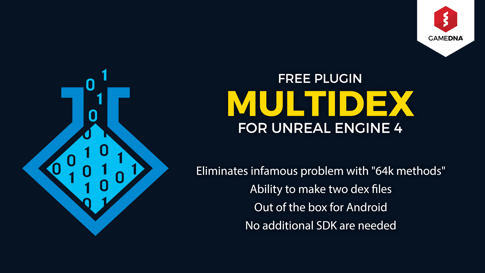
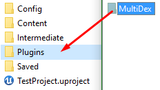
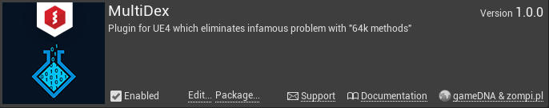

# MultiDex

**MultiDex** eliminates infamous problem with 64k methods and has the ability to make two dex files. It works out-of-the-box for the Android platform so no additional SDKs are needed. No more problems!

* **Current version:** 1.2.0
* **Binaries compiled for:** Unreal Engine 4.16
* **Required Unreal Engine 4.16 or above.**

## Features
* Eliminates infamous problem with "64k methods"
* Ability to make two dex files
* Out of the box for Android platform
* No additional SDKs are needed

## Knowledge
Plugin was made in collaboration with [zompi.pl](http://zompi.pl). You can find more info about resolving MultiDex problem [here](http://zompi.pl/multidexing-in-unreal-engine-4/).

## Setup
1. Copy this folder to the *Plugins* folder located in the main path of your project.

  

2. Enable MultiDex in *Edit -> Plugins -> Misc -> MultiDex*.

  

3. Go to _[PROJECT_FOLDER]/Build/Android/_

  a) If you already have created _custom_rules.xml_ file, simply add:
  ```xml
  <import file="custom_rules_multidex.xml" optional="true" />
  ```
  b) If you don't have created _custom_rules.xml_ file yet, copy it from [[PLUGIN_FOLDER]/Extras/custom_rules.xml](Extras/custom_rules.xml).
  
4. Add new environment variable _JAVA_OPTIONS = -Xmx2048m -Xms256m -Xss8m

   _Example for Windows:_ Control Panel -> System and Security -> System -> Advanced system settings -> Environment Variables -> Uses variables for X -> New...
   
5. You should enable _MultiDex_ plugin only if you exceeded 64k methods limit. If you have a project that doesn’t need multidexing the build will fail!

Plugin icon designed by _Freepik_.
